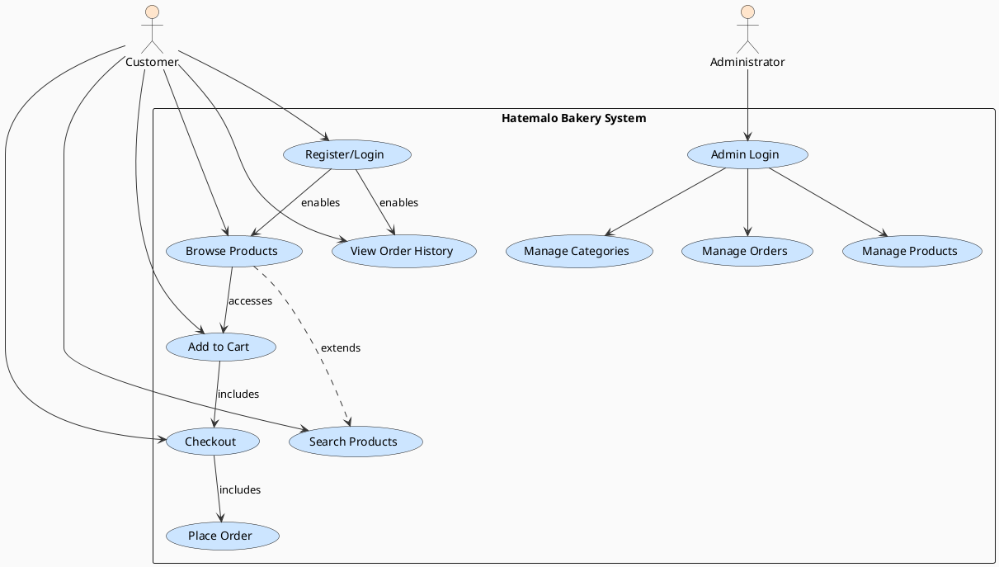

# Hatemalo Bakery - Use Case Diagram

## Overview
This document presents the use case diagram for the Hatemalo Bakery e-commerce platform, illustrating all actors, use cases, and their relationships within the system.

## Use Case Diagram

## Actor Descriptions

### Customer
An end user who can browse the product catalog, search for items, manage a shopping cart, and place orders. Customers must register and login to view their order history.

### Administrator
A staff member responsible for managing products, categories, and customer orders in the system.

## Key Use Cases Description

### Customer Use Cases

- **Register/Login**: Customers create accounts and authenticate to access personalized features
- **Browse Products**: Customers view all available bakery products
- **Search Products**: Customers search for specific products using keywords
- **Add to Cart**: Customers add products to their shopping cart
- **Checkout**: Customers proceed to checkout and enter delivery details
- **Place Order**: Customers submit their order for processing
- **View Order History**: Authenticated customers can view their previous orders

### Admin Use Cases

- **Admin Login**: Administrator authenticates to access management features
- **Manage Products**: Administrator can create, edit, and delete products
- **Manage Categories**: Administrator can organize products through categories
- **Manage Orders**: Administrator can view and update customer orders

---

**Last Updated**: April 1, 2026
**Project**: Hatemalo Bakery E-commerce Platform
**Version**: 1.0
